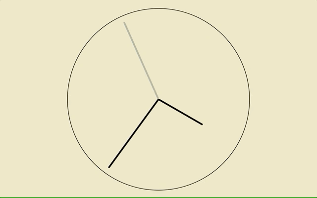

# JS & CSS Clock

The JS & CSS clock is a digital version of the analog clock using Vanilla JS and CSS. It includes three hands, for second, minute and hour. All of the hands are positioned in a way that should be transformed from the right, so it must be set to transform - origin: 100% and rotate them to 90 degrees using a basic percentage calculation. The same steps have to be repeated for all hands and the calculation is based on its specifications. For example, we should divide seconds and minutes by 60 but remember to divide hour by 12.  JavaScript has a built-in method to check for the current time.

# Objective

The goal is to apply a rotation onto each of the hands (seconds, minute, hour) based on the current time.

- Find the current seconds time

- Calculate how much is the rotation of the hand

- Default rotation should be 90 degrees

- Repeat the same steps for hours and minutes

# Improvements

- There was a flicker issue when all of the hands passed 12 o'clock due to the transformation resetting back to the beginning. I fixed this by creating a function with an if/else statement that removes the transition style when the hand passes 12 and the degrees are set to 90.

